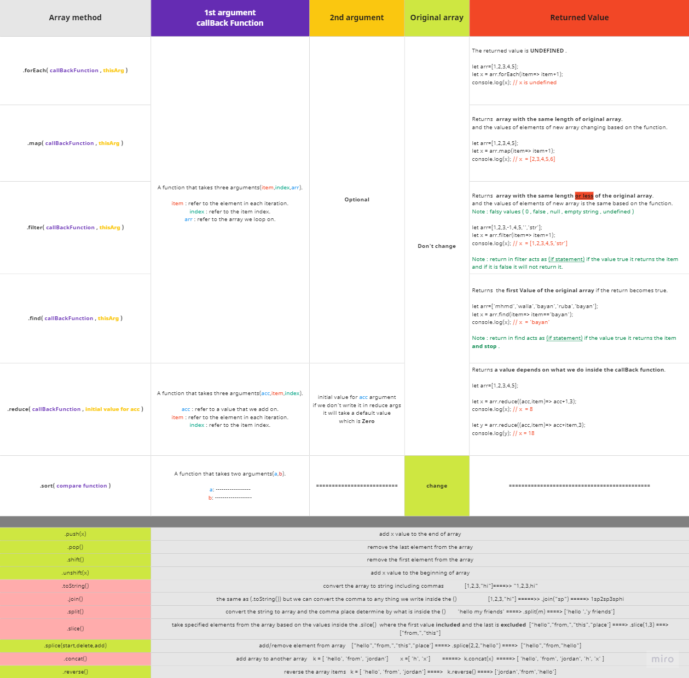

# JS-bootcamp

### LV-13
---
<pre>
  var :
  - Redeclare ( Yes )
  - Access before declaration ( Undefined )
  - Variable Scope Drama [ add the variable to the window opject ] ( Yes )
  - Block and function scope (next lectures)

  let 
  - Redeclare ( No with Error )
  - Access before declaration ( Error )
  - Variable Scope Drama [ add the variable to the window opject ] ( No )
  - Block and function scope (next lectures)

  const 
  - Redeclare ( No with Error )
  - Access before declaration ( Error )
  - Variable Scope Drama [ add the variable to the window opject ] ( No )
  - Block and function scope (next lectures)
</pre>
---
### LV-14 
---
<pre>
Character Escape Sequences 
as : 

\n for new line
\ to ignore anything after
\\ to write \ 

and more of them to know more search [ Character Escape Sequences ]
</pre>
---
### LV-N
---
<pre>
  Apply css on console :

  we use %c to tell that i want to style this using css rules

  console.log('%cHEllo %cworld','color:red; font-size:40px' , "font-size:40px")

  here the first %c will take the first style
  the second %c will take the second style

  if i dont add the second %c the second style will be printed on console also and the first style will applied at the hole first log
</pre>

---
### LV-18
---
<pre>
  Arithmetic Operators:
  + for adding and concatinationg
  - for sub and if i do (10 - 'any string'  will give NaN typeof nan is number also)
  * multiply 
  / divide 
  ** exponintial
  % module
  ++ icrement [pre,post]
  -- decrement [pre,post]
</pre>
---
### LV-19
---
<pre>
  Unary plus and Unary negation 
  by add + or - befor the data to transform it

  + => Unary plus [Return a number if its not a number]
  - => Unary negation [Return a number if its not a number but in negative form]

  console.log(+100)   // 100 
  console.log(+'100')   // 100 
  console.log(+'-100')   //  -100
  console.log(+'osama')   //  NaN
  console.log(+'15.5')   // 15.5  
  console.log(+0xff)   //   255  (hexa number)
  console.log(+null)   //  0
  console.log(+false)   //  0
  console.log(+true)   //  1

  console.log(-100)   // -100 
  console.log(-'100')   // -100 
  console.log(-'-100')   //  100
  console.log(-'osama')   //  NaN
  console.log(-'15.5')   // -15.5  
  console.log(-0xff)   //   -255  (hexa number)
  console.log(-null)   //  -0
  console.log(-false)   //  -0
  console.log(-true)   //  -1
</pre>
---
### LV-20
---
<pre>
  Type Coercion  (الاكراه)

  let a = 'osama'
  let b = '10'
  let c = 20
  let d = true 

  console.log(b + c)  // 1020  (concatination applyed)
  console.log(+b + c) // 30    (we used unary here to do it as mathmatical operation)
  console.log(a - c)  // NaN   no concatination here to applyed, it will autocheck if can do it as unary but also the unary of osama is NaN
  console.log(b - c)  // -10   auto unary here the unary of '10' is 10 
  console.log("" - 2)  // -2     auto unary of "" is 0
  console.log(b + c + d)  // 1020true   first it concat b & c with result 1020 as string then concat true as string also
  console.log(c + d + b) //2110   first add the numbers then concat
  console.log(c + d - b) // 11   first add the numbers then the unary of b 
  console.log(c + d - a) // NaN   first add the numbers then the unary of a is NaN so NaN 
  console.log(+b + c + d)  // 31
</pre>
---
### LV-23
---
<pre>
  Numbers :
  all numbers in javascript called Double Precision

  console.log(1000000)  // 1000000 
  console.log(1_000_000)  // 1000000   (_) called syntactic sugar its ignored and used to make numbers readable
  console.log(1e6)  // 1000000 
  console.log(10 ** 6)  // 1000000 
  console.log(1000000.00)  // 1000000 

  console.log(Number.MAX_VALUE)  // 1.7976931348623157e+308 
  console.log(Number.MAX_VALUE + 1000)  // 1.7976931348623157e+308
  console.log(Number.MAX_SAFE_INTEGER)  // 9007199254740991    AFter this integer the operations are creazy
</pre>
---
### LV-24
---
<pre>
  Numbers Methods :
  Note : i can use two dots instade of () to deal with methods if the number is integer

  - toString()
    console.log(100..toString())  // 100 as string
    console.log(100.1.toString())  // 100.1 as string
    console.log((100).toString()) // 100 as string
  
  - toFixed()
    console.log(100.5555.toFixed(2))  // 100.56  'string' if the number before is 5 or more it will be rounded
    console.log(100.5545.toFixed(2))  // 100.55  'string'
  
  - ParseInt()
    console.log(parseInt('100'))  // 100 as  a number
    console.log(parseInt('100 osama'))  // 100 as  a number
    console.log(+'100 osama')  // NaN
    console.log(parseInt('100.500 osama'))  // 100  a number

  - ParseFloat()
    console.log(ParseFloat('100.500 osama'))  // 100.5  a number

  - Number.isInteger()
    console.log(Number.isInteger('100'))  // false
    console.log(Number.isInteger(100.500))  // false
    console.log(Number.isInteger(100))  // true
  
  - Number.isNaN()
    console.log(Number.isNaN('Osama'))  // true   it unary the thing if nan it will give true if not it will give false
    console.log(Number.isNaN('100'))  // false
    console.log(Number.isNaN(100))  // false
</pre>
---
### LV-25
---
<pre>
  Math Object

    Math.round()    // round the number to integer Math.round(100.56) => 101 , Math.round(100.46) => 100
    Math.ceil()     // Math.ceil(10.1)  => 11
    Math.floor()    // Math.floor(10.6)   => 10
    Math.random()   // any random number between 0 - 0.9999
    Math.min()      // Math.min(5,6,7,8,-1) => -1
    Math.max()      // Math.max(5,6,7,8,-1) => 8
    Math.pow()      // the  power of number Math.pow(10,6)  == (10 ** 6)
    Math.trunc()    // ignore the part after the dot and keep the number integer  Math.trunc(100.9) => 100
</pre>
---
### LV-27
---
<pre>
  String Methods

  let x= 'ahmad'
    
    - Access by index              // x[0] = a
    - Access by charAt() method   // x.charAt(0)  = a
    - length                     // x.length = 5
    - trim() to remove the spaces BEFORE and AFTER the string ONLY let y = '  ah mad '  => y.trim() = 'ah mad'
    - toUpperCase()
    - toLowerCase()
    - 
</pre>
---
### LV-28
---
<pre>
  String Methods

  Note : mand from mandatory and opt from optional

  let x = 'Hello people this is war'

  - indexOf(value [mand] , start [Opt] default is 0)  //  x.indexOf('this') =>  13  (if no result it will give -1)
  - lastIndexOf(value [mand] , end [Opt] default is length) // x.indexOf('o') =>  8 find the index of first o from the last 
  - slice(start [mand] , end [opt] not included )
      x.slice(2,10)  => 'llo peop'
      x.slice(-7,-3) => ' is '   //slice in negative deal with length not index and from the end
  - repeat(Times)
  - split(seperator [opt],limit [opt])
      x.split() => ['Hello people this is war'] ,
      x.split('') => ['H', 'e', 'l', 'l', 'o', ' ', 'p', 'e', 'o', 'p', 'l', 'e', ' ', 't', 'h', 'i', 's', ' ', 'i', 's', ' ', 'w', 'a', 'r']
      x.split(' ') => ["Hello" , "people" , "this" , "is" , "war"]
      x.split(' ' ,2) => ["Hello" , "people"]
</pre>
---
### LV-29
---
<pre>
  String Methods

  - subString()
  - subStr()
  - includes(value [mand], start [opt] default 0)
  - startWith(value [mand], start [opt] default 0)
  - endWith(value [mand], length [opt] default full length)
</pre>
---
### LV-36
---
<pre>
  Logical Or ||
    if the value is one of the following :
    Null / undefined / any false value (0 ,"",false)
    it will take the next side.

      console.log(Null || 'Hello')  // 'Hello'
      console.log(0 || 'Hello')  // 'Hello'
  
  Nullish coalescing Operator ??
    if the value is only (Null / undefined)
    it will take the next side

      onsole.log(Null ?? 'Hello')  // 'Hello'
      console.log(0 ?? 'Hello')  // 0
</pre>
---
### LV-38
---
<pre>
  Switch
  
  - switch condition is type sensitive 
    switch ('10') is not like switch(10)
    that means it will take the case with the same type and value 

  - break word usage 
    if i dont use break after each case it will take all the casses for the same value

    switch('hello') {

      case 'hello': 
      console.log('meow');
      break ;

      case 'hello' :
      console.log('meow');
      break ;
    }

    the output here is 'meow' one time

    switch('hello') {

      case 'hello' :
      console.log('meow');

      case 'hello' :
      console.log('meow');
      break ;
    }

    the output here is 'meow' two time

  - we can use defalut case any where but if i dont use it in the end we must add break also to avoid more one output
</pre>
---
### LV-40
---
<pre>
  if we do typeof any array the result is object

  we can use Array.isArray() to check the arrays by true and false answer
  let x = [1,2,3]
  Array.isArray(x)  // true
</pre>
---
### LV-41/42/43/44/45/46
---
<pre>
  Arrays Methods :

  - unshift(value1 , value2 ..etc)                                           (change the original array)    
  - push(value1 , value2 ..etc)                                              (change the original array)    
  - shift()                                                                  (change the original array)    
  - pop()                                                                    (change the original array)   
  - includes()
  - indexOf(value[mand], start index [opt] default is 0)
  - lastIndexOf(value[mand], length by index [opt] default is last index)
  - sort(compareFunction [opt])  // sort the data from 0 - 1 - a - z         (change the original array) 
  - reverse()  // to reverse the array                                       (change the original array) 
  - splice(start[0],deleteCount , element added)                             (change the original array)
  - concat(added array or elements )  
  - join()     //change the array to a string
</pre>

---
### LV-Notes:
---
<pre>
  Loops controlling :
  break : to stop the loop and go out
  contenuie : to skip the loop iteration based on a condition  
</pre>
---
### LV-61:
---
<pre>
  Functions :

  parameter VS aurgument

  function test(anyValue) {        // anyValue is function parameter
    console.log(anyValue);
  } 
  
  test('Ali')  // ali is function aurgument

  - if i dont set an aurgument to parameter it will be undifined
    or we can set this vale when we declare the parameter.
    function(num1,num2=0)
  
  - we can use Rest parameter if we dont know the number of parameters we need 
    function(...test)

    - test is an array depends on the aurgs we will use 
    - we cant use more one rest parameter 
    - if we need to declare normal parameters the rest must be the last one 
      function(num1,num2,...nums)
</pre>
---
### LV-64:
---
<pre>
  Functions :

  - Anyonimus functions are fucntions without names 
    that we use for events for examble and no need to name them

  - If we store the function inside a variable we can access the function using
    the variable name but it will lose the hoisting feature so we cant access it 
    before the variable decleration , because it will use run time (when reach define)
</pre>
---
### LV-86:
---
<pre>
  DOM :
    - when the html file loaded the browsed creates model (an object) for this html file caled document.
</pre>
---
### LV-92:
---
<pre>
  Events :
    - We can use events in html file or in linked js file 
    - onclick
    - oncontextmenu (right click)
    - onmouseenter
    - onmouseleave
  
    - onload
    - onscroll
    - onresize
  
    - onfocus  (click on feild)
    - onblur   (leave the feild)
    - onsubmit 
</pre>
---
### LV-94:
---
<pre>
  Events simulator:
  - i can make an event happens when other event happens

  document.getElementById('btn').onclick = () = > {
    document.getElementById('btn-two').click();
  }

  if i click on btn element btn-two will cliked automatically 

    window.onload = () = > {
    document.getElementById('input').focus();
  }

  if the page loaded the input will be under focus event
</pre>
---
### LV-95:
---
<pre>
  classList methods:
  - length
  - contains
  - item (by index)
  - add
  - remove
  - toggle
</pre>
---
### LV-96:
---
<pre>
  DOM Style :
  - i can do inline style or edit the stylesheet file using dom
  
    - to do inline style we can use the property style.

        let element = document.getElementById('test');

        element.style.color = 'red';
        element.style.backgroundColor = 'black'

        or type css text direct like :

        element.cssText = 'color:red; background-color: black;'   // as css 100% 

        to remove or add properties we can use 'setPropery' or 'removePropery'

        element.setPropery('font-size','40px, 'important')       // as css 100%  
        element.removePropery('font-size')    

    - to edit css file style we can use the property stylesheets.   //it will give an array with all sheets we use 

        document.stylesheets[0].rules[0].style.addProperty('background-color','red')
    
</pre>
---
### LV-97:
---
<pre>
  DOM inserted element place :

  let x = document.getElementsByTagName('div')[0]
  let y = document.createElement('p')

    x.before(y)  // add the element y before the element x
    x.after(y)  // add the element y after the element x

    x.append(y)   // add the element inside y but as last element
    x.prepend(y)  // add the element inside y but as first element

    x.remove()   // to remove the element x from the dom tree
</pre>
---
### LV-98:
---
<pre>
  DOM Traverse :

  - nextSibling()  // get the first thing (any even if its a comment) after the element on the same level
  - previeosSibling()  // get the first thing (any even if its a comment) before the element on the same level

  - nextElementSibling()  // get the first element after the element on the same level
  - previeousElementSibling()  // get the first element before the element on the same level

  - parentElement()    // to select the element parent

</pre>
---
### LV-99:
---
<pre>
  DOM Cloning :

  if i said 

  let x = document.getElementById('test');
  let y = document.getElementById('test-div');

  y.appendChild(x);   // in this way i changed the place of the element to be inside 'test-div'

  if i want to copy the element to be in more than one place we can do the following

    let x = document.getElementById('test').cloneNode();      //this is a cloned element now from the original
    let y = document.getElementById('test-div');

      y.appendChild(x);   // in this way i copy the element to be inside 'test-div'

      .cloneNode(true / false =default)
        -true to copy the element with attributes and the inner content
        -false (default) to copy the element with attributes and ignore what inside the element
</pre>
---
### LV-102:
---
<pre>
  BOM :
    -stands for browser object model (window)
    - every thing is inside window object (document , console  ,variables and functions)

    What can i do with window object ?
    - open window
    - close window
    - move window
    - resize window
    - print window
    - run code after period of time once or more
    - fully controle the url
    - save data inside the browser (localStorage)
</pre>
---
### LV-103:
---
<pre>
  BOM :
    -stands for browser object model (window)
    - every thing is inside window object (document , console  ,variables and functions)

    What can i do with window object ?
    - open window
    - close window
    - move window
    - resize window
    - print window
    - run code after period of time once or more
    - fully controle the url
    - save data inside the browser (localStorage)
</pre>
---
### LV-104:
---
<pre>
  SetTimeOut() :

  - setTimeOut(callback,time ,callback aurgs1 ,args 2 ..etc)
  - we can assign it to variable and it will retern the number of settimeout
  - 
  function test(name) {
    console.log(`hello ${name});
  }

  let x = settimeout(test,1000,'ali')
  or
  let x = settimeout(()=>{test('ali')},1000)
  let y = settimeout(()=>{test('mohammad')},1000)

  console.log(x) // 1
  console.log(y) // 2

  we can cancle the time out function by using 
  clearTimeOut(timeOutNumber)

  clearTimeOut(x);  // to cancel the first time out
</pre>
---
### LV-105:
---
<pre>
  SetInterval() :

  - SetInterval(callback,time ,callback aurgs1 ,args 2 ..etc)
  - we can assign it to variable and it will retern the number of SetInterval
  - 
  function test(name) {
    console.log(`hello ${name});
  }

  let x = SetInterval(test,1000,'ali')
  or
  let x = SetInterval(()=>{test('ali')},1000)
  let y = SetInterval(()=>{test('mohammad')},1000)

  console.log(x) // 1
  console.log(y) // 2

  we can cancle the time out function by using 
  clearSetInterval(SetIntervalNumber)

  clearSetInterval(x);  // to cancel the first time out
</pre>
---
### LV-106:
---
<pre>
  BOM :
  Location object 
    - href  // to get or set the url hash file and mail
    - replace()   // replace the url of the page without saving it into history (can't go back)
    - assign()    //  the url of the page with ability to saving it into history 
    - reload()   // reload the page
    - host       // get the host or edit it
    - hash       // get the hash or edit it
    - protocol   // get the protocol or edit it
</pre>
---
### LV-107:
---
<pre>
  BOM :
  -open(url,target,featurs,historysave)  // to open new window
    all are [opt]
    - url : window url
    - target : new page "_blank" or same page "_self"
    - featurs : width , hieght , left ,top 
    - historysave : true or false
  
  -close() // to close a window (works only with opened using js)

  window.open('https://google.com','_blank',"width=200,height = 400 , left = 20" , true)
</pre>
---
### LV-108:
---
<pre>
  BOM :
    History object :
      property 
      length // to get the number of saved urls inculdes the current page

      methods :
      -back()  // to back to previos url
      -forward()  // to go to next page
      -go()    // to go to any url by place  0 = current , 1 = forward , -1 = back , -2 = back+1 ..etc
</pre>
---

### LV-108:
---
<pre>
  BOM :
  - stop()    // to stop loading
  - focus()  // to select the open page of the browser
  - scrollTo(x-axis,y-axis , options as behavior smooth)    //  static location
  - scrollby(x-axis,y-axis , options as behavior smooth)   //  scroll based on last scroll place
</pre>
---
### LV-113:
---
<pre>
  sessionstorage is exaclty like the localstorage but if i close the tap ill lose the data
  
  - if i refresh the page the session will keep 
  - if i want to open new tap with the session data i must use dublicate tap not new tap with the same url
</pre>
---
### LV-115:
---
<pre>
  Arrays Destruchuring :
  let arrayTest = [1,2,3,4];

  // create new variables with the value of array items

    let [a,b,c,d] = arrayTest
    console.log(a);     // 1
    console.log(b);     // 2
    console.log(c);     // 3
    console.log(d);     // 4

  // variables are exist with the value of array items

    let a;
    let b;
    let c;
    let d;

    [a,b,c,d] = arrayTest;

  // skip the third element

    let [a,b,,d]= arrayTest;
</pre>
---
### LV-117:
---
<pre>
  swaping using destruchering 

  let book = 'Video';
  let video = 'Book';

  // Old way :

    let stash = book;

    book = video;
    video = stash;

  // Neow way :
    [book , video] = [video,book];

</pre>
---